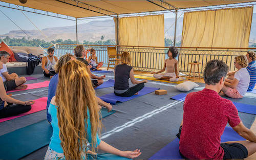
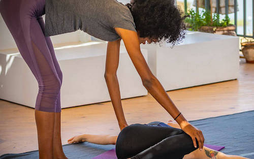
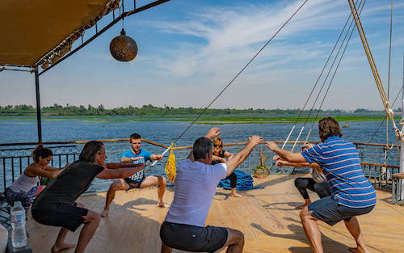
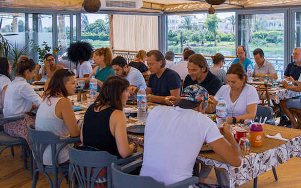
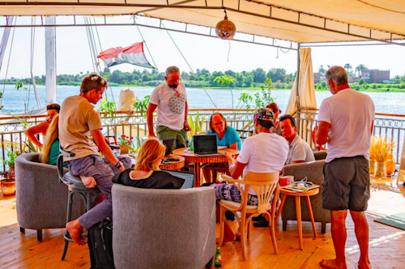

# ACTIVITIES

Welcome to the Veda Knowledge base section designed to drives you throughout the different rooms and parts of the boats. 

## YOGA & MEDITATION DECK: Time to connect with your inner soul 

 
Yoga & Meditation is the art of science of systematically observing, accepting, understanding, and training each of the levels of our being, such that we may coordinate and integrate those aspects of ourselves and dwell in the direct experience of the center of consciousness. 

 

<!--  -->

<!--  -->

Please look at the [session](sessions) to know the time and the location 

 

## MUSIC BAR: Surround yourself with good music and people

 

The Veda crew invites you to join the various musician in [Veda1](veda1) and artists. Relax and enjoy the moment. 

 
 

## RESTAURANT: Provide you with incredible vegan and vegetarian food 

Gathering all together, discover the vegan and vegetarian foods and dishes, made with love by our crew. 

 

Discover the time when breakfast, lunch and dinner will be served [here](sessions).

 

## CO-WORKING ROOM: Where you can work peacefully

 

All the 3 Dahabiyas have a co-working room. Don't hesitate to work with your current and new members of your professional circles.

 

