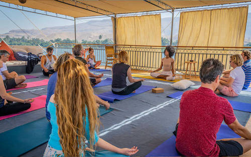

# Yoga & Meditation 

Yoga & Meditation is the art of science of systematically observing, accepting, understanding, and training each of the levels of our being, such that we may coordinate and integrate those aspects of ourselves and dwell in the direct experience of the center of consciousness. 

Please look at the [session](sessions) to know the time and the location 

