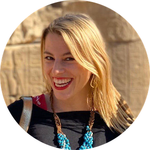

# VEDA team

## Isabelle Peeters
### Mother of VEDA

 

Isabelle is a fun-loving person. She is the owner of the Veda boats and hosts retreats on the beautiful river Nile. Everything Isabella does comes from the heart with an enormous amount of passion. Her dreams is to help people grow in awareness, and make the world a

 
 

## Karoline Zizka
### Administration & Hospitality

 

Currently serving by coordinating with people on particular projects, always having the most productive and playful outcomes for the Highest Good of all in mind and heart.

 
 

## Dave De Belder
### The Chef

 

As the Michelin star chef, Dave has always been very conscious about food and how it ties in with spirituality, healing and peoples conscience. Dave has worked in the best kitchens this world has to offer. Elbulli (ES), Librije (NL), El Celler de Can Roca (ES) and his own Godevaart (BE) & Cara & Co (AU).

 
 

## Maher A Hakeim
### Operational Manager

 

38 years experience in hotels management in Egypt, USA, Jordan.
Worked in Sheraton Nile Cruises, Hilton Luxor, Oberoi Nile Cruises, Choice Hotels International, Solaris Nile Cruises, Movenpick Luxor, MS Aurora, Helnan Shepheard Hotel, Solymanwya Golf Resorts Creative Hotels & Resorts, Porto Sokhna & Porto World, Down Town, Hollywood Sharm, and Optima Hotels & Resorts in Egypt. Belle View hotels in Jordan, Pines Manor NJ, Woodbridge Hilton NJ, and Balboa Bay Club CA
Travel America, NY, A&K Egypt, SAM Tours Egypt.

 
 

## Hassan
### Boat Manager

 

 
 

## Boat crew
### Team members maintaining boats

 

