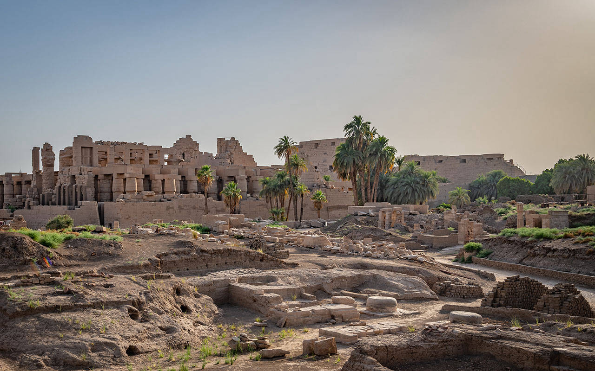
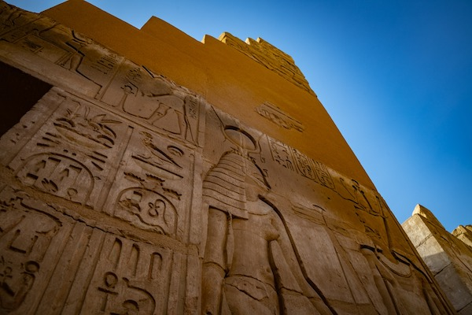
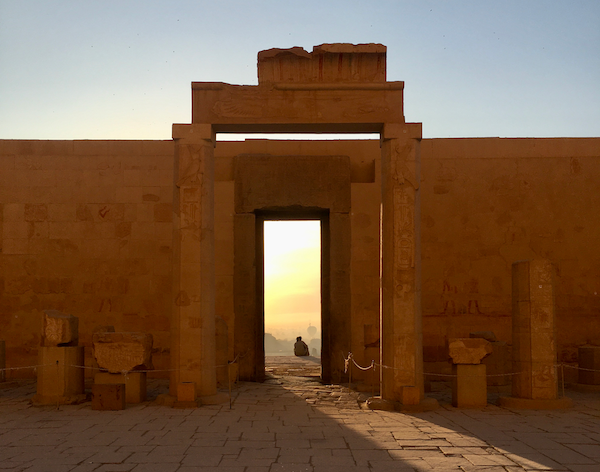
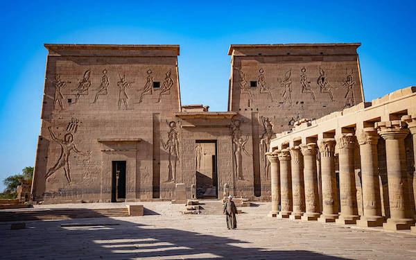

# A RIVER FULL OF SACRED PLACES

By following the natural flow of the river you will discover some of the most sacred places of the world.
 

All our trips are designed according to your wishes. Your group's tailored itinerary will lead you to the locations and temples which fit your energy.

 
 

## KARNAK TEMPLE
 

 

The second most visited historical site in Egypt after the Giza Pyramids near Cairo.
 

It consists of four main parts, of which only the largest is currently open to the general public. The term Karnak often is understood as being the Precinct of Amun-Re only, because this is the only part most visitors see.
 

The three other parts, the Precinct of Mut, the Precinct of Montu, and the dismantled Temple of Amenhotep IV, are closed to the public.
 

A famous aspect of Karnak is the Great Hypostyle Hall in the Precinct of Amun-Re, a hall area of 50,000 sq ft (5,000 m2) with 134 massive columns arranged in 16 rows.

Leran more about Karnak Temple [HERE](https://en.wikipedia.org/wiki/Karnak).

 
 

## EDFU TEMPLE
 

 

Edfu was built in the Ptolemaic Kingdom between 237 and 57 BC and is one of the best preserved shrines in Egypt.
 

The inscriptions on the temple walls provide important information on language, myth and religion during the Hellenistic period in Egypt. In particular, the Temple's inscribed building texts provide details of its construction, and also preserve information about the mythical interpretation of this and all other temples as the Island of Creation.
 

Leran more about Edfu Temple [HERE](https://en.wikipedia.org/wiki/Temple_of_Edfu).

 
 

## TEMPLE OF ISIS
 

 

The Temple of Isis is a Roman temple dedicated to the Egyptian goddess Isis. This small and almost intact temple was one of the first discoveries during the excavation of Pompeii in 1764.
 

Principal devotees of this temple are assumed to be women, freedmen, and slaves.
 

Isis mystery cult worshipped a compassionate goddess who promised eventual salvation and a perpetual relationship throughout life and after death. 
 

The temple itself was reconstructed in honor of a 6-year-old boy named Numerius Popidius Celsinus by his freedman father, Numerius Popidius Ampliatus, and his mother Corelia Celsa, to allow the child to enter elite society.
 

Leran more about Temple of Isis [HERE](https://en.wikipedia.org/wiki/Temple_of_Isis_(Pompeii)).
