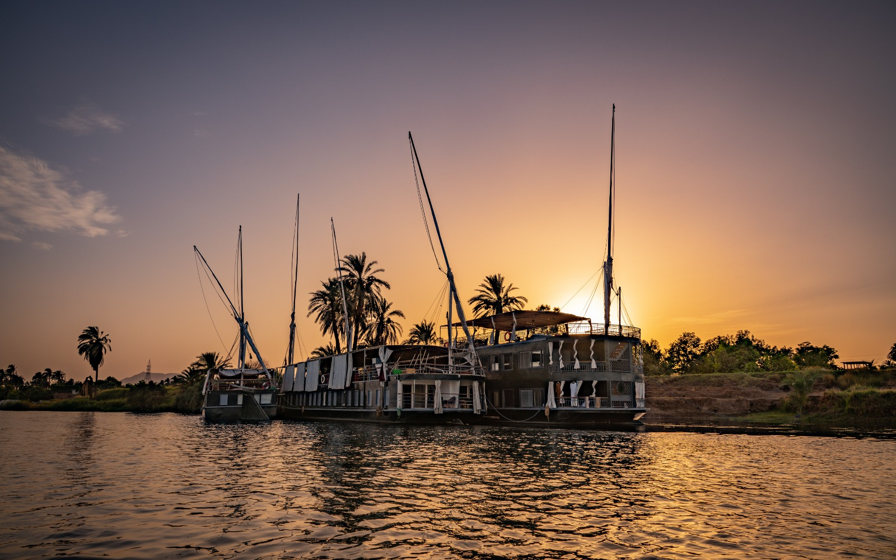

# FreeFlow Nation's Nile Trip 2021
## (24th April - 30th April)

## AGENDA

 

### 1st DAY

**SATURDAY**, April 24th, 2021

|time |activity |
|--- |--- |
| 06:30 - 07:30 | Breakfast |
| 10:00 - 12:00 | Guests arriving |
| 12:00 - 13:00 | Lunch |
| 13:30 - 16:00 | FreeFlow Session (Ootopia) |
| 17:00 - 19:30 | Luxor Temples |
| 20:00 - 21:00 | Dinner |
| 20:00 - 24:00 | Guests arriving |

 

### 2st DAY

**SUNDAY**, April 25th, 2021

|time |activity |
|--- |--- |
| 06:30 - 08:30 | Breakfast |
| 06:30 - 11:00 | Karnak (temple) |
| 12:00 - 13:00 | Lunch |
| 12:00 - 20:00 | sail to Esna (8 hours) / Esna Lock |
| 14:00 - 16:00 | FreeFlow Session |
| 16:00 - 18:00 | FreeFlow Session |
| 20:00 - 21:00 | Dinner |

 

### 3rd DAY

**MONDAY**, April 26th, 2021

|time |activity |
|--- |--- |
| 05:30 - 06:30 | Yoga |
| 06:30 - 08:30 | Breakfast |
| 06:30 - 16:00 | Sail to Edfu (9 hours) |
| 10:00 - 12:00 | FreeFlow Session |
| 12:00 - 13:00 | Lunch |
| 17:00 - 19:30 | Visit Edfu |
| 19:30 - 20:30 | Lightshow Booked for 20 people (250 Egyptian Pounds) |
| 20:00 - 21:00 | Dinner |
| 21:30 - 22:30 | Dinner for people who go to Edfu |

 

### 4th DAY

**TUESDAY**, April 27th, 2021

|time |activity |
|--- |--- |
| 05:00 - 06:00 | Yoga |
| 07:00 - 09:00 | Breakfast |
| 06:00 - 12:00 | Sail to Al Maniha Island nearby Kom Ombo (6 hours) |
| 10:00 - 12:00 | FreeFlow Session |
| 13:00 - 14:00 | Lunch |
| 14:30 - 16:00 | FreeFlow Session |
| 16:00 - 17:30 | FreeFlow Session |
| 18:00 - 22:00 | Cacao Ceremony, Sound Healing, Ecstatic Dance |
| 22:00 - 23:00 | Dinner |

 

### 5th DAY

**WEDNESDAY**, April 28th, 2021

|time |activity |
|--- |--- |
| 05:00 - 06:00 | Early Breakfast for people who are going to Isis Temple |
| 06:00 - 07:00 | Leave with Bus to Isis Temple |
| 07:00 - 08:00 | Breakfast for guests who are staying on the boat |
| 07:00 - 09:30 | Isis Temple |
| 09:30 - 11:00 | Drive back to Al Maniha Island where the boat is|
| 11:00 - 21:00 | Sailing to Esna (10 hours) |
| 13:00 - 14:00 | Lunch |
| 14:30 - 16:30 | Freeflow Session |
| 16:30 - 18:30 | Freeflow Session |
| 20:00 - 21:00 | Dinner |

 

### 6th DAY

**THURSDAY**, April 29th, 2021

|time |activity |
|--- |--- |
| 05:30 - 06:30 | Yoga |
| 06:30 - 11:30 | Sail to Luxor ( 5 hours) |
| 07:00 - 08:00 | Breakfast |
| 10:00 - 12:00 | Freeflow Session |
| 13:00 - 14:00 | Lunch |
| 14:30 - 16:30 | Freeflow Session |
| 16:00 - 16:30 | PCR test on the boat |
| 16:30 - 18:30 | Freeflow Session |
| 20:00 - 21:00 | Dinner |

 

### 7th DAY

**FRIDAY**, April 30th, 2021

|time |activity |
|--- |--- |
| 06:30 - 07:30 | Breakfast |
| 06:00 - 07:00 | Leave with mini bus |
| 10:00 - 12:00 | Freeflow Session |
| 13:00 - 14:00 | Lunch |
| 14:00 - 20:00 | Free afternoon in Luxor (Receive PCR test certificates) |
| 20:00 - 21:00 | Dinner |

 